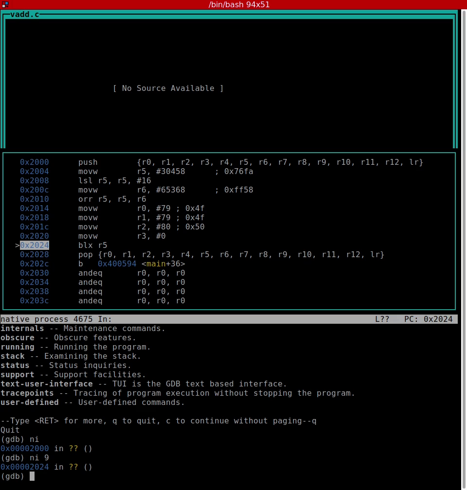

Faster Dynamically Instrumented Programs
========================================

_A look at floating-point emulation in ARM Linux_

Overview
--------

This is the final submission of my third-year project at King's College London.

### **Abstract**

This project borrows existing dynamic program instrumentation techniques to propose a faster method of emulating floating-point instructions on Unix-like operating systems than what is provided by the kernel. The proposed method replaces floating-point instructions with branches that indirectly lead to emulation code resident in the same process’ memory. This prevents some execution flow switching into kernel code to run the kernel’s floating-point instruction emulator which theoretically reduces overhead for every instruction emulated.

**Table of Contents**
---------------------

*   Introduction
    
*   Installation
    
*   Build Instructions
    
*   Testing
    
*   References


Introduction
-------------------

This tool is designed to be built and run on Armel Debian on an ARMv7(-a) CPU. It requires the 'librunt' and 'keystone' GitHub repositories aswell as other dependencies listed in "dependencies.txt" which can be installed from Debian's repositories using the 'apt' tool.

**Installation**
----------------

To set up the project, clone the repository:

```
git clone https://github.com/mbeardwell/arm-fp-emu.git
cd arm-fp-emu
```

Build instructions
-------------------
1. To install dependencies:

```
bash install-dependencies.sh
```

_Note: The script automates installation but does not guarantee robustness or safety._

2. Download dependency repositories

  The 'librunt' and 'keystone' GitHub repositories need to be downloaded to the contrib/librunt and contrib/keystone folders.
  These are not included already because I did not contribute to them.
  This can be done from the project root directory using commands like:
  
```
git clone https://github.com/stephenrkell/librunt.git contrib/librunt
git clone https://github.com/keystone-engine/keystone.git contrib/keystone
```

3. Build

```
make librunt
make keystone
make arm-fp-emu
make build-tests
```

This can take hours which is why each must be made separately. If something goes wrong building one, less progress is lost restarting at the point of failure.
    
**Testing**
-----------

To run tests:

```
make test
```

This will run something of the form

```
LD_LIBRARY_PATH=[...]/lib LD_PRELOAD=./build/arm-fp-emu.so ./tests/build/vadd10 10
```

LD_LIBRARY_PATH is necessary for how I'm using Keystone, but Keystone could technically be used in a way that removes the need to use this environment variable.

**Video Walkthrough**
---------------------

An overview of the project and demonstration can be seen in the video below:

[](assets/code-walkthrough.mp4)

**Project Paper**
--------------------

The full project report is available here:  
[Download the Report](docs/1681382_report.pdf)

**References**
--------------
